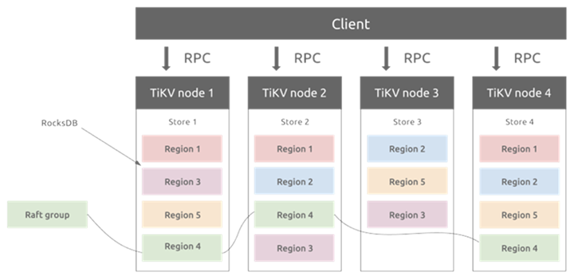
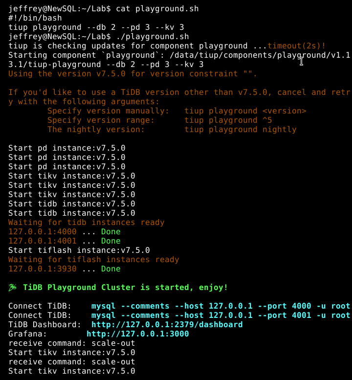
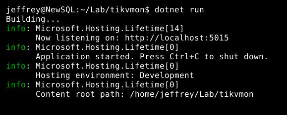
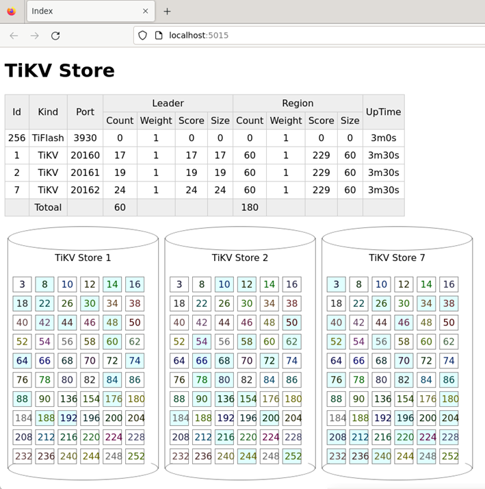

# TiDB 分散式架構與負載平衡實驗
---

## 實驗簡介

TiDB 以每個 Region 96MB 為單位將資料分群，平均分散於多個 TiKV 節點，每個 Region 有三個 Replica，使用 Raft 共識算法決定其中一個為 Leader 負責資料讀寫及 Raft Log 同步至其他 Follower。PD 會調節確保每個 Region Group 都有三個 Region Replica，並盡力維持各 TiKV 節點的 Region 數及 Leader 數目相當以分散負荷，達到負載平衡的目標。



本實驗將透過查詢 TiDB 系統 View TIKV_STORE_STATUS 及 TIKV_REGION_PEERS 取得各節點之 Region、Leader 數量，以及每一 Region Group 之 Replica、Leader 所在位置，使用 ASP.NET Core 專案以網頁圖表形式呈現，觀察 TiDB 在增刪節點後之 Region 分佈變化，驗證 TiDB 可在分散式架構中確保資料完整及負載平衡。

## 準備工作

1. TiDB 安裝  
   參考文件 [TiDB 数据库快速上手指南](https://docs.pingcap.com/zh/tidb/stable/quick-start-with-tidb) 於 Linux 安裝 TiDB
    ```bash
    curl --proto '=https' --tlsv1.2 -sSf https://tiup-mirrors.pingcap.com/install.sh | sh
    ```
2. .NET SDK 安裝  
   參考文件 [在Ubuntu 20.04上安裝 .NET SDK](https://learn.microsoft.com/zh-tw/dotnet/core/install/linux-ubuntu-2004)  
   ```bash
   wget https://packages.microsoft.com/config/ubuntu/20.04/packages-microsoft-prod.deb -O packages-microsoft-prod.deb
   sudo dpkg -i packages-microsoft-prod.deb
   rm packages-microsoft-prod.deb
   sudo apt-get update && \
   sudo apt-get install -y dotnet-sdk-8.0
   ```
   
## 實驗步驟

1. 使用 tiup playground 指定執行一組 TiDB 服務，包含 PD x 3 + TiDB x 2 + TiKV x 3
   ```bash
   tiup playground --db 2 --pd 3 --kv 3
   ```
   
2. 執行 ASP.NET Core 專案  
   切換到專案所在目錄 (/tikvmon)，執行 ASP.NET Core 網站
    ```bash
    dotnet run
    ```
    
3. 使用瀏覽器開啟 ASP.NET Core 網址 (例如：`http://localhost:5015`)
    
4. 使用 tiup 指令新增兩個 TiKV 節點  
    ```bash
    tiup playground scale-out --kv 2
    ```
5. 觀察 TiKV 節點數是否增加到五個，Region 與 Leader 數量是否維持不變且平均分散於各節點
6. 使用 tiup 查詢並刪除其中一個 TiKV 節點
    ```bash
    tiup playground display # 查詢 tikv 的 pid
    tiup playground scale-in --要刪除的pid
    ```
7. 觀察 TiKV 節點數是否減少到四個，Region 與 Leader 數量是否維持不變且平均分散於各節點

[YouTube 展示影片](https://www.youtube.com/watch?v=2hsTIHLIf-c)

[](http://www.youtube.com/watch?v=2hsTIHLIf-c "TiKVMon 操作展示")